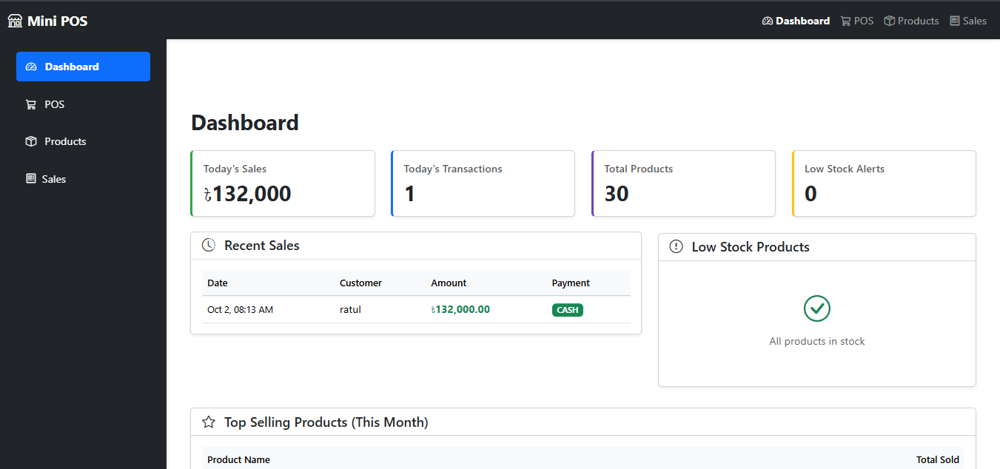
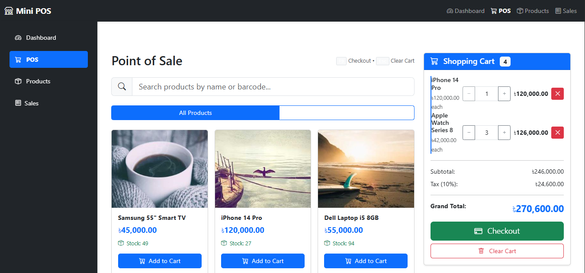
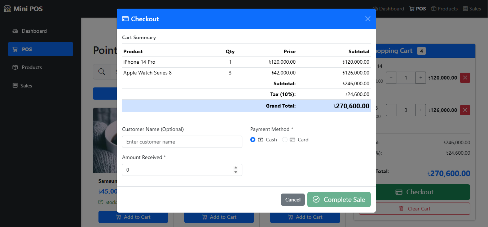
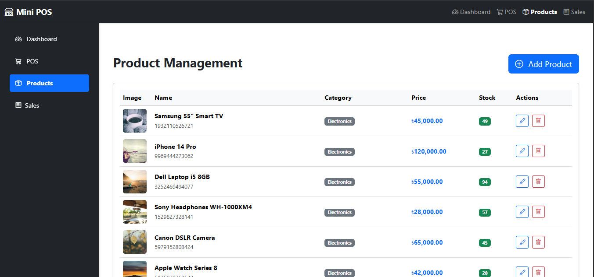
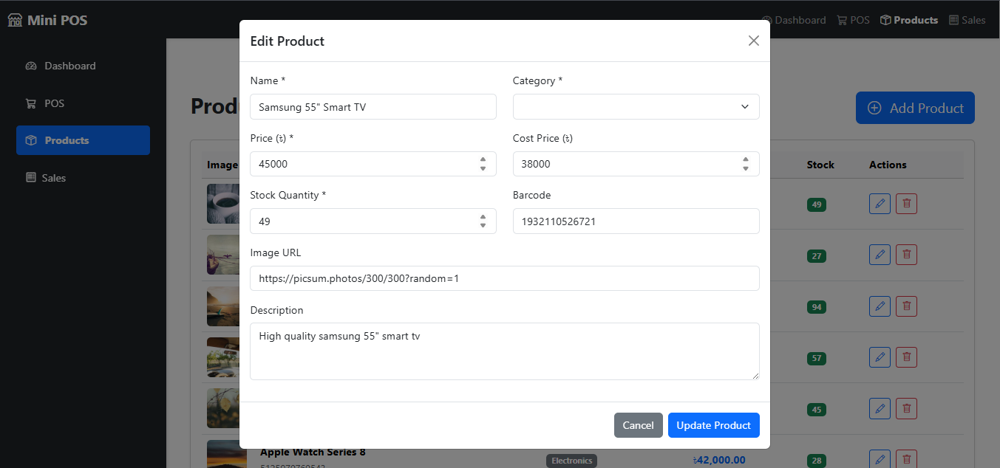
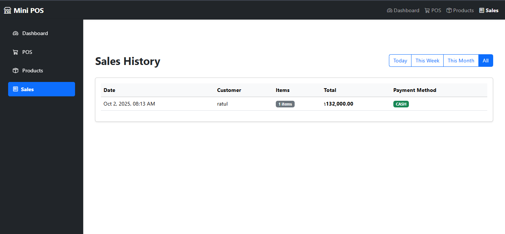

# Mini POS System

**Professional Point of Sale System** | Laravel 10 + Vue.js 3 + MySQL 8

## 🎯 Purpose

Portfolio project demonstrating full-stack development skills for job applications. Built in 12 hours showcasing Laravel backend, Vue.js frontend, and modern web development practices.

## ✨ Features

✅ **Product Management** - Complete CRUD with categories  
✅ **Real-time POS Interface** - Search, add to cart, checkout  
✅ **Inventory Tracking** - Auto stock updates on sales  
✅ **Sales Processing** - Cash/Card payments with change calculation  
✅ **Dashboard** - Live statistics and insights  
✅ **Sales History** - Transaction records with filtering  
✅ **Category System** - Organize products efficiently  
✅ **Low Stock Alerts** - Inventory monitoring  
✅ **Responsive Design** - Mobile, tablet, desktop ready

## 🛠️ Tech Stack

| Layer | Technology |
|-------|-----------|
| **Backend** | Laravel 10.x |
| **Frontend** | Vue.js 3 (Composition API) |
| **Database** | MySQL 8.0 |
| **UI Framework** | Bootstrap 5 |
| **State Management** | Pinia |
| **Build Tool** | Vite |
| **API Style** | RESTful |

## 📦 Installation

### Prerequisites

- PHP 8.2+
- Composer
- Node.js 18+ & NPM
- MySQL 8.0
- Git

### Setup Steps

**1. Clone repository**
```bash
git clone https://github.com/your-username/mini-pos.git
cd mini-pos
```

**2. Install PHP dependencies**
```bash
composer install
```

**3. Install JavaScript dependencies**
```bash
npm install
```

**4. Configure environment**
```bash
cp .env.example .env
php artisan key:generate
```

Edit `.env`:
```env
DB_DATABASE=mini_pos
DB_USERNAME=root
DB_PASSWORD=
```

**5. Setup database**
```bash
mysql -u root -p
CREATE DATABASE mini_pos;
exit;
```

**6. Run migrations & seeders**
```bash
php artisan migrate
php artisan db:seed
```

This creates:
- 5 categories
- 30 demo products
- Ready-to-use POS system

**7. Start development servers**

Terminal 1:
```bash
php artisan serve
```

Terminal 2:
```bash
npm run dev
```

**8. Access application**
```
http://localhost:8000
```

## 🗄️ Database Schema

**categories** (5 records)
- id, name, slug, description
- Relationship: hasMany products

**products** (30 records)
- id, category_id, name, price, stock_quantity, barcode, image
- Relationship: belongsTo category, hasMany saleItems

**sales**
- id, total_amount, payment_method, customer_name, tax, subtotal
- Relationship: hasMany saleItems

**sale_items**
- id, sale_id, product_id, quantity, unit_price, subtotal
- Relationship: belongsTo sale, belongsTo product

## 🔌 API Endpoints

| Method | Endpoint | Description |
|--------|----------|-------------|
| **Categories** |
| GET | `/api/categories` | Get all categories |
| POST | `/api/categories` | Create category |
| GET | `/api/categories/{id}` | Get single category |
| PUT | `/api/categories/{id}` | Update category |
| DELETE | `/api/categories/{id}` | Delete category |
| **Products** |
| GET | `/api/products` | Get paginated products |
| POST | `/api/products` | Create product |
| GET | `/api/products/{id}` | Get single product |
| PUT | `/api/products/{id}` | Update product |
| DELETE | `/api/products/{id}` | Delete product |
| GET | `/api/products/search/{query}` | Search by name/barcode |
| GET | `/api/products/low-stock` | Get low stock products |
| **Sales** |
| GET | `/api/sales` | Get sales with filters |
| POST | `/api/sales` | Create new sale |
| GET | `/api/sales/{id}` | Get sale details |
| **Dashboard** |
| GET | `/api/dashboard/stats` | Get dashboard statistics |

## 🚀 Deployment

### Railway (Recommended)

**1. Push to GitHub**
```bash
git add .
git commit -m "Ready for deployment"
git push origin main
```

**2. Deploy on Railway**
- Visit railway.app
- Connect GitHub repository
- Add MySQL database
- Set environment variables
- Deploy automatically

**3. Environment Variables**
```env
APP_KEY=base64:YOUR_KEY_HERE
APP_ENV=production
APP_DEBUG=false
DB_CONNECTION=mysql
DB_HOST=${{MySQL.MYSQL_HOST}}
DB_PORT=${{MySQL.MYSQL_PORT}}
DB_DATABASE=${{MySQL.MYSQL_DATABASE}}
DB_USERNAME=${{MySQL.MYSQL_USER}}
DB_PASSWORD=${{MySQL.MYSQL_PASSWORD}}
```

**Live Demo**: [Your Railway URL]

## 🧪 Testing

**POS Flow**
1. Navigate to POS page
2. Search "laptop" or browse products
3. Add items to cart
4. Adjust quantities
5. Click Checkout
6. Enter payment details
7. Complete sale
8. Verify stock decreased

**Product Management**
1. Go to Products page
2. Click "Add Product"
3. Fill form and submit
4. Edit existing product
5. Delete product (with confirmation)

**Dashboard**
1. View today's sales statistics
2. Check transaction count
3. Review low stock alerts
4. See recent sales list

## 📸 Screenshots

# Mini POS System

<div align="center">
  
</div>

<div align="center">
  
</div>

<div align="center">
  
</div>

<div align="center">
  
</div>

<div align="center">
  
</div>

<div align="center">
  
</div>

## 🎨 Features Showcase

**POS Interface**
- Grid view of all products
- Real-time search
- Category filtering
- Add to cart with quantity control
- Live total calculation (10% tax)
- Cash/Card payment options
- Change calculation

**Dashboard**
- Today's sales amount
- Transaction count
- Total products
- Low stock warnings
- Recent sales table
- Top selling products

**Product Management**
- Full CRUD operations
- Category assignment
- Stock management
- Barcode support
- Image URLs
- Pagination

## 👤 Author

**Your Name**
- 📧 Email: ratulrs29@gmail.com
- 💼 LinkedIn: [linkedin.com/in/shaikh-radwan-374435358](linkedin.com/in/shaikh-radwan-374435358)
- 🐙 GitHub: [@rad129ratul](https://github.com/rad129ratul)

## 📄 License

MIT License - feel free to use for your portfolio

## 🙏 Acknowledgments

Built following modern web development best practices:
- Laravel documentation
- Vue.js 3 documentation
- Bootstrap 5 components
- RESTful API design principles

## 🔥 Quick Start Commands

```bash
composer install
npm install
cp .env.example .env
php artisan key:generate
php artisan migrate --seed
php artisan serve & npm run dev
```

## 💡 Development Notes

- **Tax Rate**: 10% (configurable in SaleController)
- **Pagination**: 15 items per page
- **Low Stock Alert**: < 10 units
- **Currency**: Bangladeshi Taka (৳)
- **Demo Data**: 5 categories, 30 products